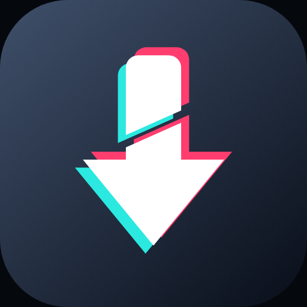
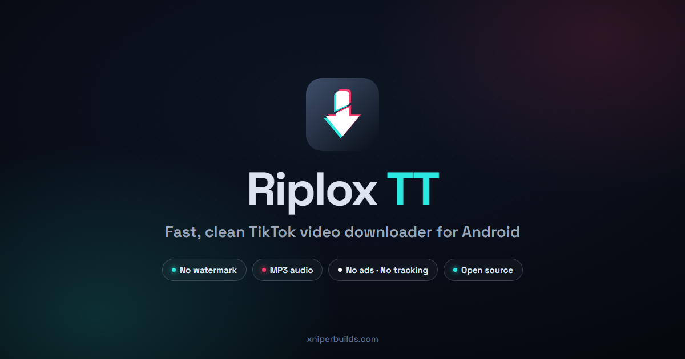
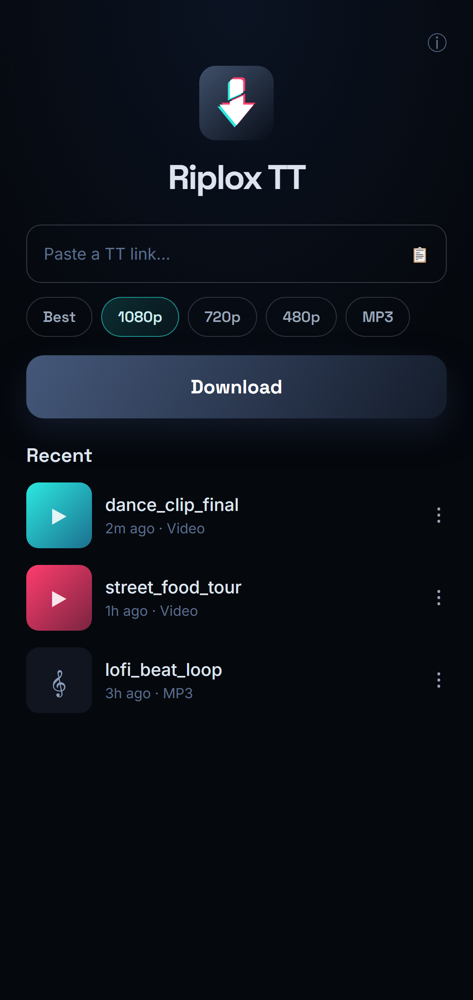
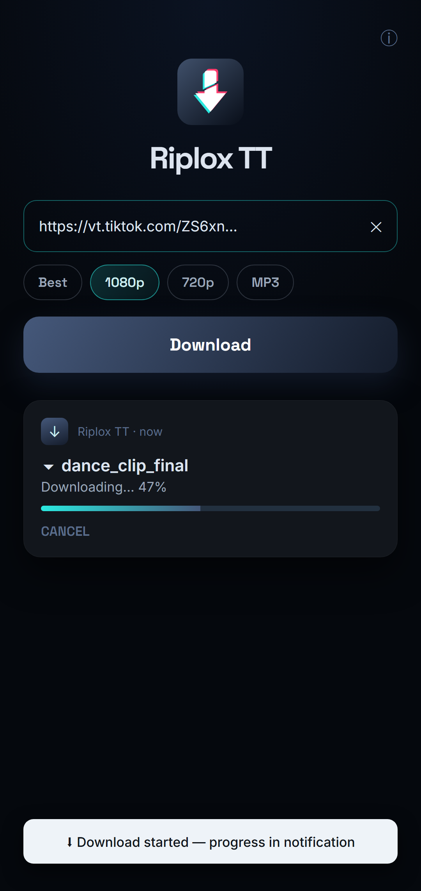
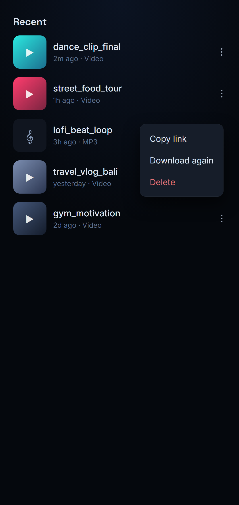
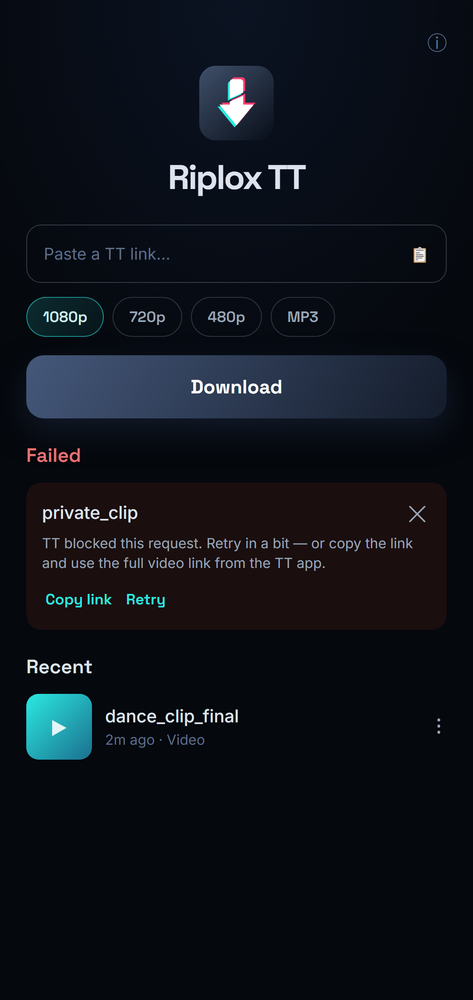

<div align="center">



# Riplox TT

**Fast, clean TikTok video downloader for Android.**

Paste a link or share from the app — the no-watermark video lands straight in your gallery. No ads, no tracking, no login.

[](https://github.com/xniperbuilds/riplox-tt/releases/latest)
[](https://github.com/xniperbuilds/riplox-tt/releases)
[](LICENSE)




</div>

---

## Screenshots

| Home | Downloading | Recent | Failed → retry |
|:---:|:---:|:---:|:---:|
|  |  |  |  |

## Features

- ⬇️ **No-watermark downloads** — paste a TikTok link, or share one straight from the app
- 📋 **Auto-paste** — copy a link, open Riplox TT, and it fills itself in
- 🎚️ **Pick your quality** — Best / 1080p / 720p / 480p, or extract **MP3** audio. Your choice is remembered
- ⚡ **Zero-tap share** — share from the TikTok app and the download just starts
- 🔔 **Live notification** — real progress, cancel anytime; downloads survive app-close & reboot with auto-retry
- ♻️ **Failed? One tap** — every failure gives you **Copy link** and **Retry**, right where you are
- 🕘 **Recent list** — tap to play, copy link, download again, or delete
- 📁 **Straight to your gallery** — video in `Movies/RiploxTT`, audio in `Music/RiploxTT`
- 🚫 **No ads. No tracking. No account.** Nothing leaves your phone except the download itself
- 🎨 **Clean AMOLED-black UI** — Material 3, one calm screen, no clutter

## Install

1. Download the latest APK from [**Releases**](https://github.com/xniperbuilds/riplox-tt/releases/latest)
2. Open it — allow *"Install from unknown sources"* if Android asks
3. Open Riplox TT, paste a TikTok link, tap **Download**

> Android 8.0 (Oreo) or newer. Works on both 64-bit and 32-bit phones.

## How it works

Riplox TT is built on the battle-tested [yt-dlp](https://github.com/yt-dlp/yt-dlp) + FFmpeg engine, wrapped in a fast, native Jetpack Compose app. It does **one thing well**: grab a TikTok video (or its audio) cleanly and quickly, with a background queue that doesn't give up if your connection hiccups. The engine updates itself quietly so links keep working.

## FAQ

**Does it add a watermark?**
No — Riplox TT saves the clean video without the TikTok watermark.

**A video won't download / says "blocked"?**
TikTok occasionally rate-limits a request. Tap **Retry**, or **Copy link** and paste the *full* video link (from the app's Share → Copy Link) instead of a short one. Private or deleted videos can't be downloaded.

**Where do my files go?**
Your gallery — `Movies/RiploxTT` for video, `Music/RiploxTT` for MP3. Photo posts go to `Pictures/RiploxTT`.

**Is it safe?**
It's open source — read the code. No ads SDK, no analytics, no accounts, no network calls except the download itself.

**Only TikTok?**
Yes, by design. Riplox TT is TikTok-only. For 1000+ other sites, see [Riplox](https://github.com/xniperbuilds/riplox).

## Building from source

```bash
git clone https://github.com/xniperbuilds/riplox-tt.git
cd riplox-tt
./gradlew assembleDebug
```

Android Studio (JDK 17+) recommended. Release builds are signed with the maintainer's key; your local builds fall back to a debug signature automatically.

## Credits

- [yt-dlp](https://github.com/yt-dlp/yt-dlp) · [youtubedl-android](https://github.com/yausername/youtubedl-android) · [FFmpeg](https://ffmpeg.org/)
- [Coil](https://coil-kt.github.io/coil/) · Jetpack Compose / Material 3

## License

[GPL-3.0](LICENSE) — free forever. If you distribute a modified version, it must stay open source.

## Disclaimer

Riplox TT is an independent app and is **not affiliated with, endorsed by, or connected to TikTok or ByteDance Ltd.** "TikTok" is a trademark of its respective owner and is used here only to describe compatibility. Please download only content you have the right to save, and respect creators' rights.

---

<div align="center">

**Riplox TT** is a [XniperBuilds](https://xniperbuilds.com) product.

⭐ Star the repo if Riplox TT saves you time — it helps more people find it.

</div>
